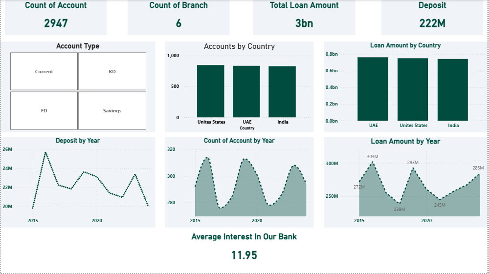

# python_banking_pipeline
A comprehensive data engineering project that handles messy banking records. Includes scripts for handling missing values, standardizing inconsistent formats, and performing complex aggregations for financial reporting

## 📊 Power BI Dashboard
I developed an interactive dashboard to visualize the insights from the cleaned banking data.

### 🖼️ Dashboard Preview

### 🔍 Key Metrics Tracked:
* **Total Balance & Loans:** High-level overview of the bank's liquidity.
* **Geographic Distribution:** Analysis of customer activity across India, UAE, and USA.
* **Account Performance:** Comparison of Savings vs. Current vs. FD accounts.
* **Risk Assessment:** Visualizing loan amounts and interest rates to identify high-exposure areas.

### How to View:
You can download the `Banking data set.pbix` file from this repository and open it using **Power BI Desktop**.
